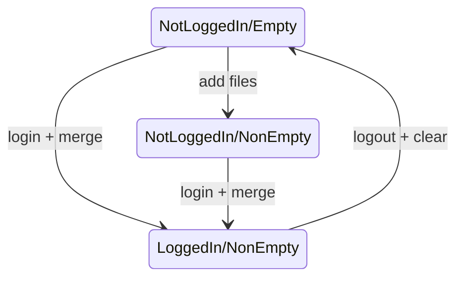

---
export_on_save:
  prince: true
---

# CSCC09 24F Final Project - WebToWeb: A Secure Web Implementation for P2P File Sharing

$\quad$ This paper presents a browser-based BitTorrent client with encrypted file-sharing functionality. The client will leverage [Remix](https://remix.run/) and [WebTorrent](https://github.com/webtorrent/webtorrent) for the frontend, with backend deployment on Google Cloud Platform. Project evaluation will focus on performance, security, and user experience.

## Group Members

| Name | Student Number | Email |
| ---- | -------------- | ----- |
| Zheyuan Wei | 1007626133 | <zheyuan.wei@mail.utoronto.ca> |

## Introduction

Video demo: <https://youtu.be/Fw5PdmKwTec>

[WebToWeb](#introduction) will be a web application designed for fast file sharing through a peer-to-peer (P2P) system. Unlike traditional methods requiring files to upload to a server before download, which can be slow and less secure, this app allows direct user-to-user file transfer, significantly enhancing speed. Additionally, encryption ensures high security for all shared files on the P2P network.

## Features

### Core Features / Beta Version

The beta version of application will incorporate following features (in order of priority):

#### File Transfer

- [x] An improved WebUI for file upload and download, allowing users to upload files and receive a unique access token.
- [x] Users can upload files and receive a unique token for access.
- [x] Users may download files by entering the unique token.
- [x] File integrity is ensured by performing a hash check before and after transfer.
- [ ] Face-to-face file sharing by scanning QR codes or other methods. (Discontinued due to purpose-related considerations)

### Additional Features / Final Version

The final version of the application will incorporate the following additional features:

#### File Transfer

- [x] Users account keep records of files uploaded and downloaded.
- [x] Visitors can upload/download files and also have a record of their activities.
- [x] Visitor activities is merged with user account upon login.
- [ ] Large files are split into chunks to accommodate browser memory constraints.
- [ ] Reassembling file chunks seamlessly on the recipient's end.
- [ ] Receivers can download the file before fully uploaded: streaming / chunking.
- [ ] Establish multiple P2P links to expedite download speed.*
- [ ] Distributing chunks to multiple users to enhance download speed.*
- [ ] Senders may close the browser and the file will still be available to download: IPFS.*

#### Security

- [x] Add accounts
- [x] OAuth, MFA, local authentication are integrated on demand for enhanced security measures.
- [ ] Files are encrypted by senders prior to upload, generating a unique decryption key.
- [ ] Receivers use this key to decrypt the file upon download.
- [ ] Embed keys directly within `magnet` links and `.Torrent` files for secure sharing.
- [ ] Time-based one-time password (TOTP) for key exchange.*

> Features marked with an asterisk (*) require proof of concept to verify feasibility and may be subject to change.
> Within the scope of the course, [WebToWeb](#introduction) will prioritize core features, with additional implementations as time allows.

## Design / Technology Stack

### Design Overview

Visitor/Logged-in User state machine (simplified):

### Frontend

- `Remix` will be used for full-stack development.
- `webtorrent` will be used for the P2P file-sharing functionality.
- Google Cloud Platform is being used for deployment.

### Backend

- `Remix` will be used for full-stack development.
- `Redis` is used as a database.
- Google Cloud Platform is being used for backend deployment.

### Libraries

We independently developed the frontend using `Remix` and implemented seeding/downloading functionality with help of `webtorrent` npm package.

#### Library Comparison

`webtorrent` utilizes one of the traditional P2P file-sharing protocols, BitTorrent, as a foundation. While BitTorrent is more trust-worthy and supports large-scale public file-sharing in extensive user networks, it may not be ideal for our application, which requires secure, private and small-scale file sharing.

A more specialized and suitable P2P method could support small group sharing, allowing senders to disconnect while files remain accessible. Though [wormhole-crypto](https://github.com/SocketDev/wormhole-crypto) could serve this need, it appears inactive for over a year, raising concerns about its reliability.

## Anticipated Challenges

Potential challenges may arise in developing [WebToWeb](#introduction), some of which may eventually be deemed unfeasible within the course scope and subject to adjustment.

1. **Purpose-related Challenge**: This project focuses on creating a secure, cost-effective, and user-friendly file-sharing application tailored for small files. Designed to eliminate the need for logins or lengthy links, it offers a faster and more flexible alternative to traditional cloud services like Google Drive, Dropbox, and OneDrive, addressing gaps in convenience and efficiency within the current market.

2. **Network Limitations**: As shown in the picture, WebTorrent network are not fully connected to the desktop BitTorrent network, rather going through a kind of "adapter". This may limit the number of users who can access the application.

   

    Additionally, a controversial issue was discussed in [Library Comparison](#library-comparison) section.

3. **WebRTC Limitations**: Even though WebRTC is supported my major modern browsers, it may not be supported by all browsers/platforms. Due to compatibility issues, this feature might be unavailable or function improperly on certain machines or systems.

4. **Security**: Not implemented

## Discussion

The app proves highly effective for quick file sharing, particularly with small files. It simplifies transferring files to or from university lab machines without requiring user logins to cloud storage or email services, or dealing with lengthy sharing links. Instead, it generates a simple 6-digit code for the recipient to download the file. Additionally, it tracks uploaded and downloaded files, making it convenient for users to resend files when needed.

The future app can be enhanced by integrating security measures like encryption and secure key exchange to safeguard user data. Costs could be minimized by decoupling the frontend and backend, hosting the static frontend on free platforms like Vercel or GitHub Pages, and deploying the backend on a more cost-efficient service.
